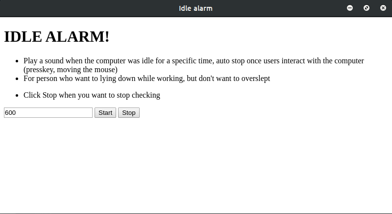

# IDLE ALARM



## Features

- Play a sound when the computer was idle for a specific time, auto stop once users interact with the computer (presskey, moving the mouse)
- For person who want to lying down while working, but don't want to overslept

## User manual

- Click Stop when you want to stop checking

## Run

```bash
npm i
npm run start
```


